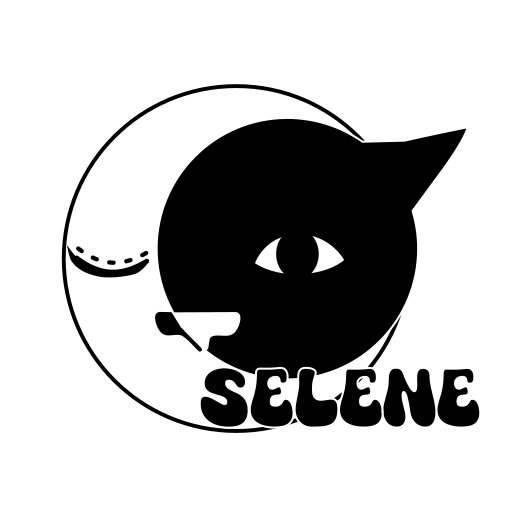

<p align="center">

</p>

# selene

Selene is an executable with embedded Lua modules for game making programming (audio, filesystem, renderer, window, ...).

## Running

After build or download a release file, you can execute the file `selene`, or `selene.exe` on Windows.
Notice that on Windows you will also need to put the `SDL2.dll` in the same folder.

The executable searches for a `main.lua` file, and it uses the lua `require` to do this job, so it will search the main file following the `package.path` hierarchy.
From running a project that is on another directory, you can use the flag `-d` and provide the path (both absolute and relative works), `selene -d examples/renderer`.

### main.lua

As I said, the entry file is a `main.lua`. The selene structure use two simple callbacks, `step` in the main loop and `quit` when closing. You can set them using `selene.set_step(function)` or `selene.set_quit(function)`.

```lua
-- main.lua
local i = 1
selene.set_step(function()
    print(i, 'aloooooooooooooooooooooo')
    i = i + 1
    if i > 50 then
        selene.set_running(false) -- do not forget to call this function to exit, otherwise the application will continue running the main loop
    end
end)
selene.set_quit(function()
    print('exiting')
end)
```

***Do not forget to call the `selene.set_running(false)` function, or you will get stuck in a infinite loop.***

### Modules

Selene have some bultin modules to easier development, all of them are available as modules:

- audio
- filesystem
- font
- json
- renderer
- window

So to create a window and renderer, you can run:

```lua
local backend = 'opengl'

local opengl = false
local vulkan = false

if backend == 'opengl' then
    opengl = true
    vulkan = false
elseif backend == 'vulkan' then
    opengl = false
    vulkan = true
end
selene{meta={org='Selene',name='App'}}
local win = selene.create_window('Selene App', 640, 380, {opengl=true})
local render = selene.create_renderer(win)

local buffer = ren:create_buffer('vertex', 1024*1024)
local tex, str = ren:load_texture2d('root://selene_icon.png')
if not tex then
    print(tex, str)
end
print(tex)

local batch = renderer.VertexBatch(9*4, 1024)
batch:set_color(1, 1, 1, 1)
batch:set_z(0)
batch:push_vertex2d(-0.5, 0.5, 0, 1, 0, 1, 1, 0, 0)
batch:push_vertex2d(0.5, 0.5, 0, 0, 1, 1, 1, 1, 0)
batch:push_vertex2d(0.5, -0.5, 0, 1, 1, 0, 1, 1, 1)

batch:push_vertex2d(-0.5, 0.5, 0, 1, 0, 1, 1, 0, 0)
batch:push_vertex2d(0.5, -0.5, 0, 1, 1, 0, 1, 1, 1)
batch:push_vertex2d(-0.5, -0.5, 0, 0, 1, 1, 1, 0, 1)

ren:send_buffer_data(buffer, batch:get_offset()*batch:get_stride(), batch:get_data())

-- load vertex shader
local vert_file = 'root://shaders/vert.hlsl'
if backend == 'opengl' then
    vert_file = 'root://shaders/vert.glsl'
    if os.host() == 'emscripten' or os.host() == 'android' then
        vert_file = 'root://shaders/vert.glsl100'
    end
elseif backend == 'vulkan' then
    vert_file = 'root://shaders/vert.spv'
end
local vert = ren:load_shader('vertex', vert_file)

-- load fragment shader
local frag_file = 'root://shaders/frag.hlsl'
if backend == 'opengl' then
    frag_file = 'root://shaders/frag.glsl'
    if os.host() == 'emscripten' or os.host() == 'android' then
        frag_file = 'root://shaders/frag.glsl100'
    end
elseif backend == 'vulkan' then
    frag_file = 'root://shaders/frag.spv'
end
local frag = ren:load_shader('pixel', frag_file)

print(vert, frag)

-- create render pipeline (WIP)
local pipeline = ren:create_pipeline{
    vs = vert,
    ps = frag,
    layout = {
        stride = 9*4,
        {name = 'a_position', offset = 0, size = 3, type = 'float'},
        {name = 'a_color', offset = 12, size = 4, type = 'float'},
        {name = 'a_texcoord', offset = 28, size = 2, type = 'float'},
    },
    blend = {enabled = true, func = 'alpha'},
    scissor = {enabled = true},
    descriptors = {
        {type = 'combined_image_sampler', stage = 'fragment'}
    }
}

selene.set_event(function(name, ...)
    if name == 'quit' or name == 'window closed' then selene.set_running(false) end
end)
selene.set_step(function()
    ren:set_render_target()
    ren:set_viewport(0, 0, 640, 380)
    ren:set_scissor(0, 0, 640, 380)
    ren:clear_color(0.3, 0.4, 0.4, 1.0)
    ren:clear_depth(1)
    ren:set_pipeline(pipeline)
    ren:set_vertex_buffer(buffer)
    ren:set_texture(tex)
    ren:draw('triangles', 0, 6)
    ren:present()
    selene.delay(16)
end)

selene.set_quit(function()
    batch:destroy()
    if pipeline then ren:destroy_pipeline(pipeline) end
    if tex then ren:destroy_texture(tex) end
    ren:destroy_shader(vert)
    ren:destroy_shader(frag)
    ren:destroy_buffer(buffer)
    ren:destroy()
    win:destroy()
end)
```

And you can use the plugins (WIP) to abstract the creation of pipelines and other technical stuff:

```lua
local RenderBatch2D = require('plugins.RenderBatch2D')
print(RenderBatch2D, RenderBatch2D.create)

selene({ meta = {org = 'My Company', name = 'Roguelike'}})
local win = selene.create_window('Roguelike', 640, 380, {opengl = true})
local ren = RenderBatch2D.create(win)

selene.set_event(function(name)
    if name == 'quit' or name == 'window closed' then selene.set_running(false) end
end)

selene.set_step(function()
    ren:begin_frame()
    ren:clear(0.3, 0.4, 0.4, 1.0)
    -- ren:set_color(1, 1, 1, 1)
    ren:draw_circle(128, 96, 32)
    ren:draw_text(ren.font, 'olar')
    ren:end_frame()
end)

selene.set_quit(function()
    ren:destroy()
    win:destroy()
end)
```

## Building

First you need to install [CMake](https://cmake.org/) on your system.

I put the [premake5](https://premake.github.io/) scripts on the `misc/scripts/` folder, but I don't have plans to update it by now.

### SDL2

By default the CMake script checks for SDL dists in the `.cache/SDL2` folder.

- MINGW
- MSVC
- source (for source code)

But you can specify the paths with:

- -DSDL_PRECOMP_DIR=\[Precompiled dir\] (SDL provides that for MINGW and MSVC)
- -DSDL_SOURCE_DIR=\[SDL source directory\]

You can also download SDL2 using the script inside `scripts/download_sdl.sh`.

### Linux

You will need to install the `SDL2` packages for development too, the package is present in the majority of the Linux distros.

In Debian you can install SDL2 with:

```
sudo apt install libsdl2-dev
```

And then run CMake:

```
cmake -B build -DCMAKE_BUILD_TYPE=[Debug|Release]
```

It will generate the build files in the `build/` folder, then just run:

```
cmake --build build
```

### Windows

For Windows, you will also need to download the [SDL2](https://libsdl.org/) package for development. Making that, simply run on a terminal:

```
cmake -B build -DSDL_PRECOMP_DIR=[Path to SDL2 MSVC dev dist, callbacks to .cache/SDL2/MSVC]
```

### Cross Compiling

On linux you can use the CMake Toolchains to cross compile between architectures.

```
cmake -B build -DCMAKE_TOOLCHAIN_FILE=[toolchain file]
cmake --build build
```

#### Toolchains

You can find the toolchains in the `cmake/toolchains` folder, and you can edit them or create new ones as you need. To cross compile for MinGW, for example:

```
cmake -B build -DCMAKE_TOOLCHAIN_FILE=cmake/toolchains/MinGW.cmake -DSDL_PRECOMP_DIR=[Path to SDL2 MinGW dev dist]
cmake --build build
```

And the process is very similar to Emscripten and Android builds, you can use the toolchains provided by those SDKs.

#### Emscripten

Download and setup the Emscripten SDK and run:

```
cmake -B build -DCMAKE_TOOLCHAIN_FILE=${EMSDK}/upstream/emscripten/cmake/Modules/Platform/Emscripten.cmake
cmake --build build
```

To a fast emsdk setup run `scripts/setup.sh emscripten`, it will download the SDK to the `.cache/` folder.

#### Android

Download and setup the Android SDK and NDK, and run the CMake with the Android toolchain:

```
cmake -B build \
    -DCMAKE_TOOLCHAIN_FILE=${ANDROID_HOME}/ndk/${NDK_VERSION}/build/cmake/android.toolchain.cmake \
    -DANDROID_ABI=[armeabi-v7a, arm64-v8a, x86, x86_64] \
    -DANDROID_PLATFORM=android-*[21, 22, ...]
cmake --build build
```

To a fast Android SDK setup, use `scripts/setup.sh android`, it will download all needed files to `.cache/`.
In the future I plan to add arg options to control SDK, NDK and platform versions.
